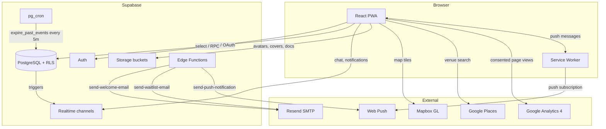
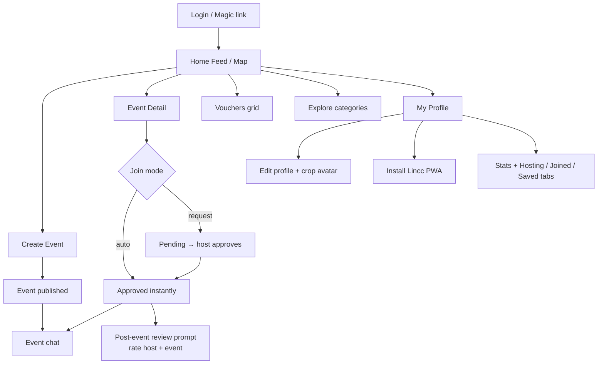
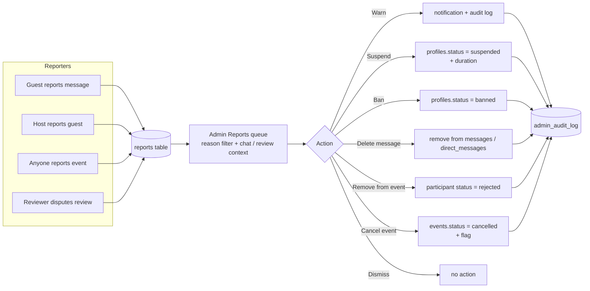
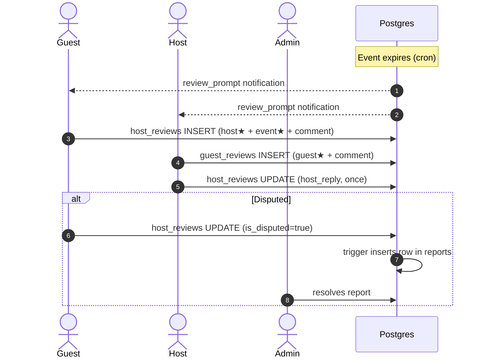
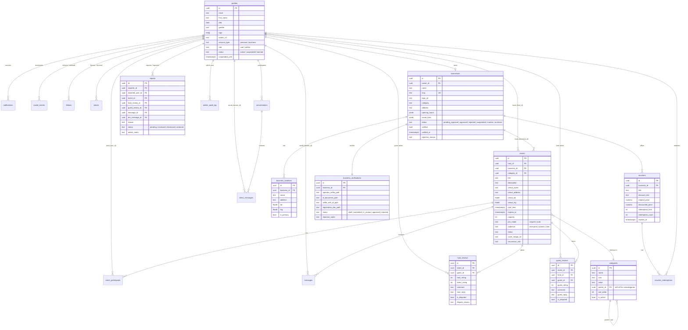

# Lincc

**Everything happening around you, in one place.**

Lincc is a local events and discovery platform that surfaces what's happening around you in real time — events, deals, openings, and offers. Personal users discover and host meetups; businesses promote themselves with verified profiles, recurring events, vouchers and (later) ticket sales. Your local pulse.

- **Live**: [lincc.live](https://lincc.live)
- **Status**: pre-launch / demo-ready
- **PRD**: `PRD/Lincc PRD V1.rtf`
- **Tasks & changelog**: [`TODO.md`](TODO.md)
- **Project guide for AI agents**: [`CLAUDE.md`](CLAUDE.md)

---

## Tech Stack

| Layer | Technology |
|-------|-----------|
| Frontend | React 19 + TypeScript 5.9 |
| Build | Vite 7, vite-plugin-pwa, Workbox |
| Styling | Tailwind CSS 4 (utility-first, runtime CSS-var theme) |
| State / Data | Supabase JS (Auth, DB, Realtime, Storage, Edge Functions) |
| Maps | Mapbox GL JS |
| Venues | Google Places (New) JS SDK |
| Image cropping | react-easy-crop |
| Errors | Sentry |
| Analytics | Google Analytics 4 (consent-gated) |
| Hosting | Vercel (auto-deploy from `main`) |

---

## High-level architecture



---

## Account & business flow

Lincc treats Personal and Business as distinct account types chosen at signup. Businesses go through admin approval and (optional) document verification to earn a tick.


---

## App flow (Personal user)



---

## Reporting & moderation

Anyone can report users, events, reviews, or chat messages. Reports flow into the admin queue with full context, and admins have a real action toolkit — not just a "mark resolved" button.



---

## Bidirectional review system

Both directions of the review relationship are first-class. Guests rate the host **and** the event; hosts rate each guest. Either party can dispute a review which lands in admin moderation.



---

## Database schema (high-level)



---

## Project structure

```
src/
├── components/
│   ├── layout/         MainLayout, Header, BottomNav, SideNav, ScrollToTop, ProtectedRoute
│   ├── ui/             Button, Card, Modal, BottomSheet, Avatar, AvatarCropper, Toggle, Skeleton, MapView…
│   ├── features/       EventReviewsSection, HostReviewsList, GuestReviewsList, ReviewPromptModal, RatingBadges
│   ├── business/       VerifiedTick, BusinessCard, BusinessHoursDisplay, BusinessApprovalBanner
│   ├── pwa/            InstallBanner, OfflineBanner, UpdateNotification, InstallAppCard
│   ├── social/         ReportDialog, ReportMessageDialog, FollowButton
│   ├── admin/          ActivityChart, EngagementChart, ActivityFeed, DateRangePicker, TopList
│   ├── AnalyticsTracker.tsx
│   └── CookieConsentBanner.tsx
├── contexts/           AuthContext (profile + business), ToastContext, ViewModeContext
├── hooks/              useRecommendedEvents, useEventChat, useDMChat, usePWA, useDarkMode,
│                       useAnalytics, useNotifications, usePendingReviews, useUserLocation, …
├── lib/                supabase, utils, algorithm, analytics, consent, imageCompression, haptics, abTest, cache
├── pages/
│   ├── auth/           LoginPage, SignupPage, TermsPage, PendingApprovalPage
│   ├── onboarding/     OnboardingPage
│   ├── admin/          DashboardPage, UsersPage, EventsPage, ReportsPage, BusinessesPage,
│                       BusinessApplicationsPage, BusinessDetailPage, CategoriesPage, AnnouncementsPage,
│                       FeatureFlagsPage, AuditLogPage, UserDetailPage
│   ├── landing/        AboutPage, PrivacyPage, TermsPage, ContactPage
│   └── *.tsx           HomePage, EventDetailPage, CreateEventPage, EditProfilePage,
│                       BusinessPage, BusinessDashboardPage, BusinessVerifyPage, EditBusinessProfilePage,
│                       VouchersPage, VoucherDetailPage, CreateVoucherPage,
│                       ChatsPage, ChatRoomPage, DMChatRoomPage,
│                       ProfilePage, UserProfilePage, FollowListPage,
│                       SavedEventsPage, ExplorePage, NotificationsPage,
│                       BusinessDirectoryPage, SearchPeoplePage, ManageParticipantsPage,
│                       FeedbackPage, SettingsPage
├── services/
│   ├── events/         eventService, recommendationService, participantService, transformers
│   ├── chat/           chatService, dmService
│   ├── reviews/        hostReviewService, guestReviewService, pendingReviewsService
│   ├── adminService.ts moderationService.ts businessService.ts voucherService.ts
│   ├── verificationService.ts notificationService.ts pushService.ts
│   ├── searchService.ts bookmarkService.ts blockService.ts reportService.ts followService.ts
│   └── placesService.ts
├── data/               categories.ts (with subcategories), demoEvents.ts, tagToCategoryMap.ts
└── types/              index.ts (domain types), supabase.ts (generated)

landing/                Separate marketing/waitlist site (own Vite build)
supabase/
├── migrations/         001 → 049 (numbered, applied in order)
├── functions/          send-welcome-email, send-waitlist-email, send-push-notification
└── email-templates/    All 13 auth/security templates + waitlist + welcome
```

---

## Key features

### Personal
- Discover events on a Mapbox map or list, filtered by radius (1–20km), date, category, audience
- Create an event in under 30 seconds with Google Places venue autocomplete
- Real-time event chat (Supabase Realtime), DMs to friends and hosts, voucher / event share cards
- 5-star bidirectional reviews with optional reply and dispute flow
- Bookmarks, follows, blocks, reports
- PWA with offline shell, install prompts, push notifications

### Business
- Verified business accounts with admin approval flow + document verification → blue tick
- Business dashboard: events, vouchers, locations, hours, social links, recent activity
- Public business profile (cover hero, stats, reviews, deals)
- Host-attributed events under business identity
- Vouchers with redemption codes, scratch-card UI, swipe-to-redeem, stock progress
- Multi-location chains (`business_locations`)

### Admin
- Dashboard with action-needed counters per management area
- Pending business applications + verification doc review (signed URLs)
- Reports queue with chat / review context + moderation toolkit (warn / suspend / ban / delete message / remove from event / cancel event)
- Categories with subcategories (parent → child cascade)
- Announcements, feature flags, audit log
- All admin actions written to `admin_audit_log` and surface user notifications

### Trust & safety
- HEIC detection + magic-byte image validation (authoritative over MIME — handles Samsung's mis-labelled `image/jpg` photos), 25MB input cap, typed `FileReadError` for cloud-only photo placeholders (Samsung Cloud / Google Photos) with a tailored toast directing the user to download the photo to device first
- Avatar cropper (round + square crops via `react-easy-crop`)
- Soft-gate for unapproved businesses (banner across app, publishing blocked at DB trigger level)
- Cookie consent gate before Google Analytics fires
- Full-screen non-dismissable update prompt when a new service worker is waiting

---

## Getting started

```bash
npm install
npm run dev
```

Create a `.env.local`:

```env
VITE_SUPABASE_URL=https://your-project.supabase.co
VITE_SUPABASE_ANON_KEY=ey…
VITE_MAPBOX_TOKEN=pk.ey…
VITE_GOOGLE_PLACES_API_KEY=AIza…
VITE_VAPID_PUBLIC_KEY=BAu2…
VITE_SENTRY_DSN=https://…@sentry.io/…
VITE_GA_MEASUREMENT_ID=G-XXXXXXXXXX   # optional — analytics no-ops without it
VITE_APP_URL=http://localhost:5173
```

The app boots at `http://localhost:5173`. Database migrations live in `supabase/migrations/` — they're reference files and don't auto-apply; run them via the Supabase Dashboard SQL editor or `supabase db push`.

---

## Scripts

| Command | Description |
|---------|-------------|
| `npm run dev` | Vite dev server with HMR |
| `npm run build` | TypeScript check + production build |
| `npx tsc --noEmit` | Type-check only (no emit) |
| `npm run test` | Vitest in watch mode |
| `npm run test:run` | Vitest single run (42 tests) |
| `npm run test:e2e` | Playwright E2E tests |

---

## Deployment

- **Hosting** — Vercel, auto-deploys on push to `main`. SPA rewrites in `vercel.json`
- **Database** — Supabase project `srrubyupwiiqnehshszd` (production-ready)
- **Email** — Custom SMTP via Resend (`noreply@system.lincc.live`); 15 branded templates
- **Push** — Web Push via VAPID + custom service worker; Edge Function `send-push-notification`
- **PWA** — vite-plugin-pwa with `autoUpdate`, runtime caching for fonts, Mapbox, Supabase
- **Cron** — `pg_cron` runs `expire_past_events()` every 5 minutes; expiry trigger fires `review_prompt` notifications

---

## Migrations cheat sheet

| # | Purpose |
|---|---------|
| 001 | Initial schema, RLS, triggers, indexes |
| 010 | `handle_new_user` trigger |
| 016 | Vouchers |
| 017 | Direct messages, conversations |
| 020 | Business profiles |
| 028 | Reviews + admin role tiers |
| 033 | `businesses` table (separate entity) |
| 034 | `business_locations` (chain support) |
| 035 | `events.business_id` |
| 042 | participant count trigger fix |
| 043 | Host reviews + dispute trigger |
| 044 | Bidirectional reviews (`host_reviews` + `guest_reviews`) |
| 045 | Account types + business approval workflow |
| 047 | Business verifications + storage bucket |
| 049 | Chat reports (`message_id`, `dm_message_id` on reports) |
| 047_fix | Restore account_type + pending business creation in `handle_new_user` (regression fix) |

Full list under `supabase/migrations/`.

---

## License

All rights reserved. Private repository.
