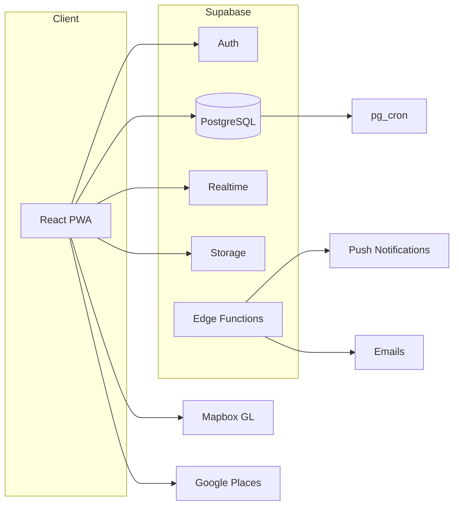
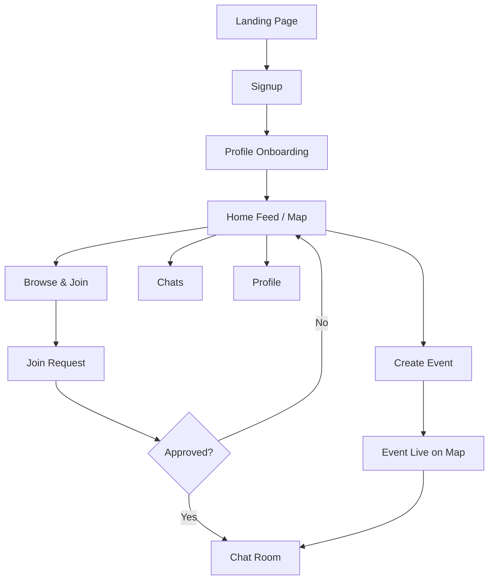
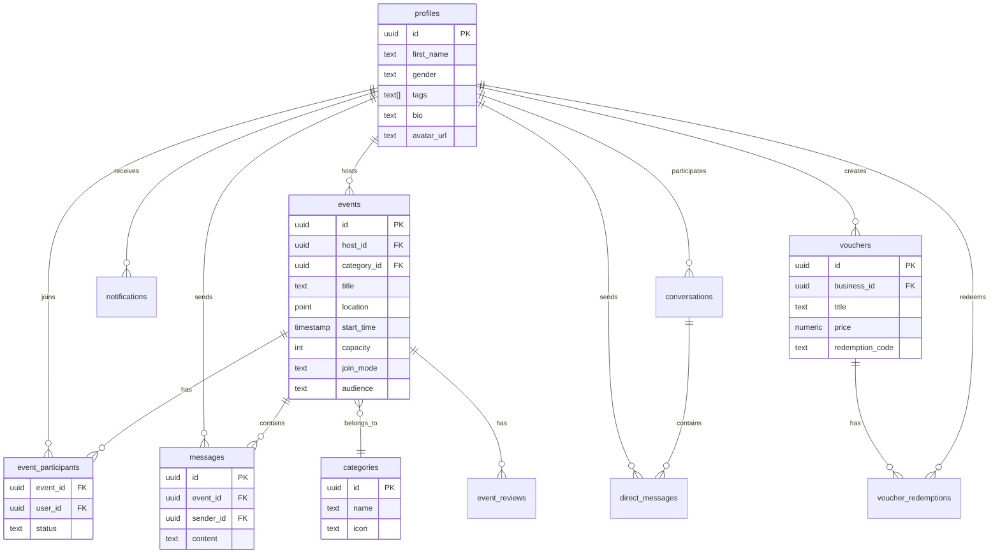

# Lincc

**Everything happening around you, in one place.**

Lincc is a local events and discovery platform that surfaces what's happening around you in real time — events, deals, openings, and offers. Your local pulse.

---

## Tech Stack

| Layer | Technology |
|-------|-----------|
| Frontend | React 19 + TypeScript 5.9 |
| Build | Vite 7 |
| Styling | Tailwind CSS 4 |
| Backend | Supabase (Auth, DB, Realtime, Storage) |
| Maps | Mapbox GL JS |
| Venues | Google Places API |
| Hosting | Vercel |
| PWA | vite-plugin-pwa + Workbox |

---

## Architecture



---

## App Flow



---

## Database Schema



---

## Project Structure

```
src/
├── components/
│   ├── layout/         # MainLayout, BottomNav, Header
│   ├── ui/             # Button, Card, Input, MapView, Skeleton
│   ├── features/       # Feature-specific components
│   ├── pwa/            # InstallBanner, OfflineBanner
│   └── admin/          # Admin dashboard components
├── contexts/           # AuthContext, ToastContext, ViewModeContext
├── hooks/              # useRecommendedEvents, useEventChat, usePWA, etc.
├── lib/                # supabase.ts, utils.ts, algorithm.ts
├── pages/              # All route pages (auth, admin, landing)
├── services/           # events/, chat/, admin, push, vouchers
├── data/               # categories, demo data, tag mappings
└── types/              # Domain types, Supabase generated types

landing/                # Separate marketing/waitlist site
supabase/migrations/    # Database migrations (reference)
```

---

## Getting Started

```bash
npm install
npm run dev
```

Create a `.env.local`:

```env
VITE_SUPABASE_URL=your_supabase_url
VITE_SUPABASE_ANON_KEY=your_anon_key
VITE_MAPBOX_TOKEN=your_mapbox_token
```

---

## Scripts

| Command | Description |
|---------|-------------|
| `npm run dev` | Start dev server (localhost:5173) |
| `npm run build` | TypeScript check + production build |
| `npm run test` | Run tests in watch mode |
| `npm run test:run` | Single test run |
| `npm run test:e2e` | Playwright E2E tests |

---

## Deployment

- **Hosting** — Vercel with auto-deploy from `main`
- **PWA** — Full offline support, install prompts, runtime caching
- **Realtime** — Supabase channels for chat and notifications
- **Cron** — `pg_cron` auto-expires events 2 hours after start

---

## License

All rights reserved. Private repository.
