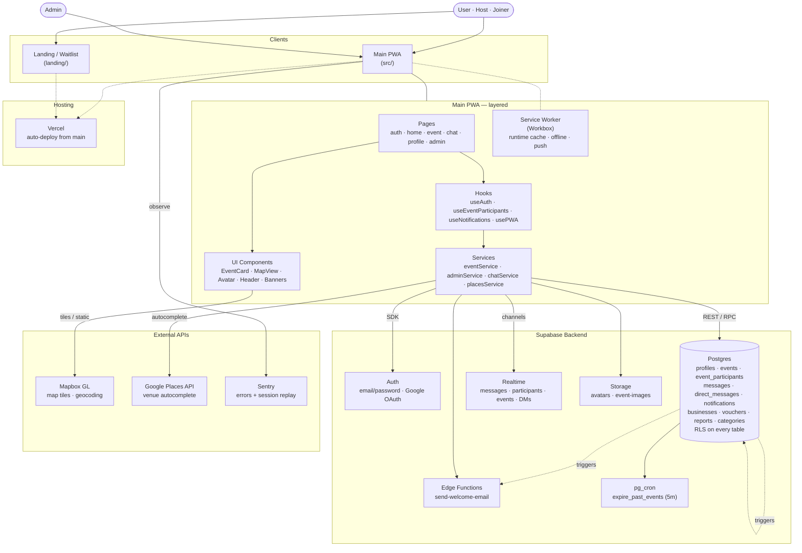
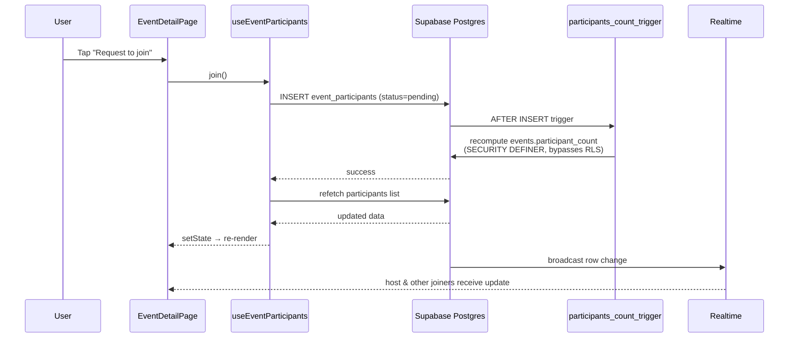

# Lincc

Your local pulse — everything happening around you, in one place. Events, deals, openings, offers — all live, all local. Pre-launch React PWA + landing site.

**Live:** [lincc.live](https://lincc.live) · **Staging:** [lincc-six.vercel.app](https://lincc-six.vercel.app)

See [`CLAUDE.md`](./CLAUDE.md) for the full product + engineering reference and [`TODO.md`](./TODO.md) for the task board.

## Architecture



### Runtime — joining an event



## Tech Stack

| Layer      | Tech                                                |
| ---------- | --------------------------------------------------- |
| Frontend   | React 19, TypeScript 5.9, Vite 7                    |
| Styling    | Tailwind CSS 4                                      |
| Routing    | React Router 7                                      |
| Backend    | Supabase (Postgres, Auth, Realtime, Storage, Edge)  |
| Maps       | Mapbox GL JS                                        |
| PWA        | vite-plugin-pwa + Workbox (injectManifest)          |
| Errors     | Sentry                                              |
| Hosting    | Vercel                                              |

## Getting Started

```bash
# Main app
npm install
npm run dev            # localhost:5173
npm run build          # tsc + vite build
npm run test:run       # vitest

# Landing site (separate)
cd landing
npm install
npm run dev
```

Create a `.env.local` with `VITE_SUPABASE_URL`, `VITE_SUPABASE_ANON_KEY`, `VITE_MAPBOX_TOKEN`, and `VITE_GOOGLE_PLACES_API_KEY`.

## Project Structure

```
src/
├── pages/          # Route-level components (admin, auth, landing, main app)
├── components/     # layout · ui · pwa · admin · features · social
├── hooks/          # useAuth, useEventParticipants, usePWA, useBookmarks, ...
├── services/       # events, chat, admin, notifications, bookmark, search, ...
├── contexts/       # AuthContext, ToastContext, ViewModeContext
├── lib/            # supabase client, algorithm, haptics, utils
├── data/           # categories, tag↔category maps, demo events (fallback)
└── sw.ts           # Workbox service worker (injectManifest)

supabase/
├── migrations/     # 000–042 — reference only; apply via dashboard or CLI
└── email-templates/

landing/            # Separate Vite app for waitlist page
```

See [`CLAUDE.md`](./CLAUDE.md) for the complete reference — tables, routes, RLS, design system, and conventions.
