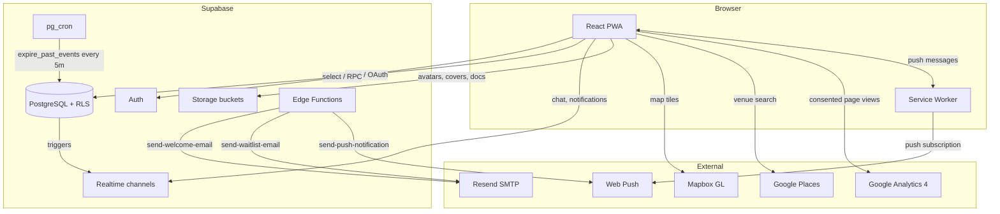
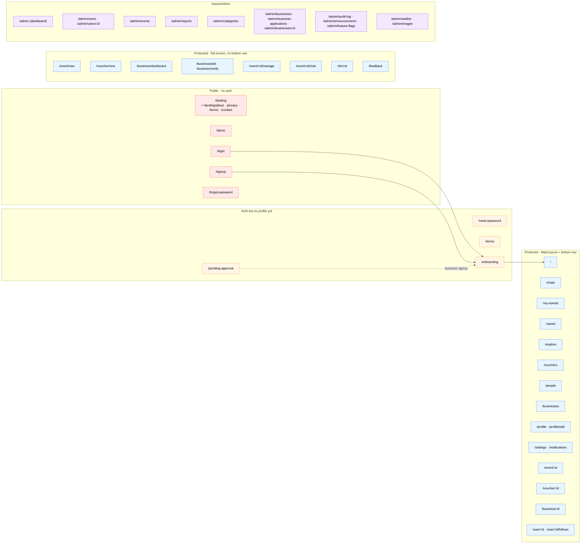
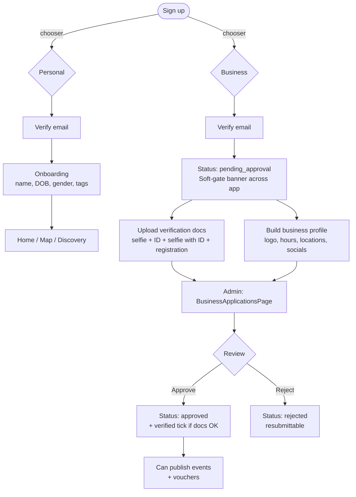
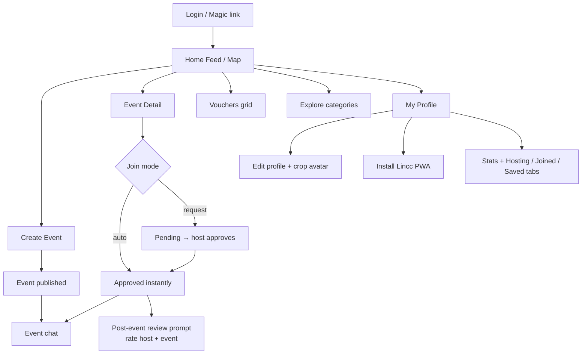
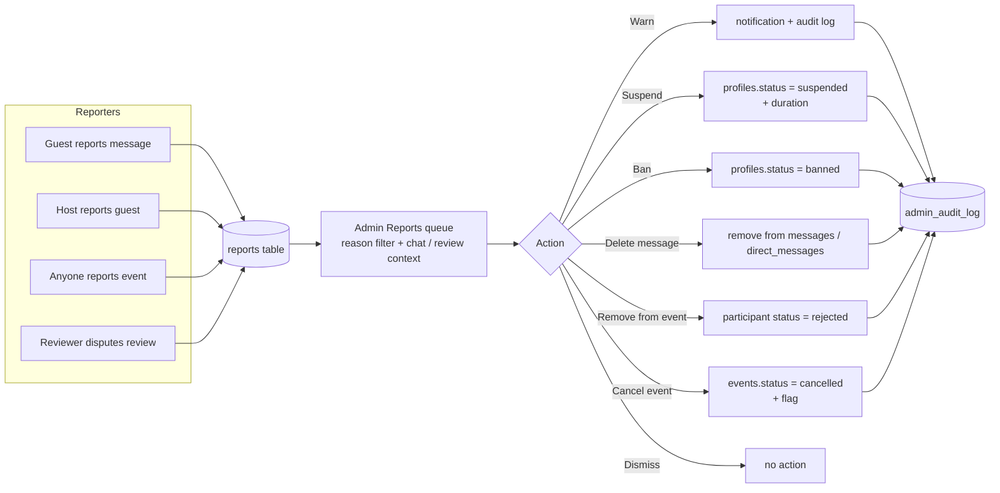
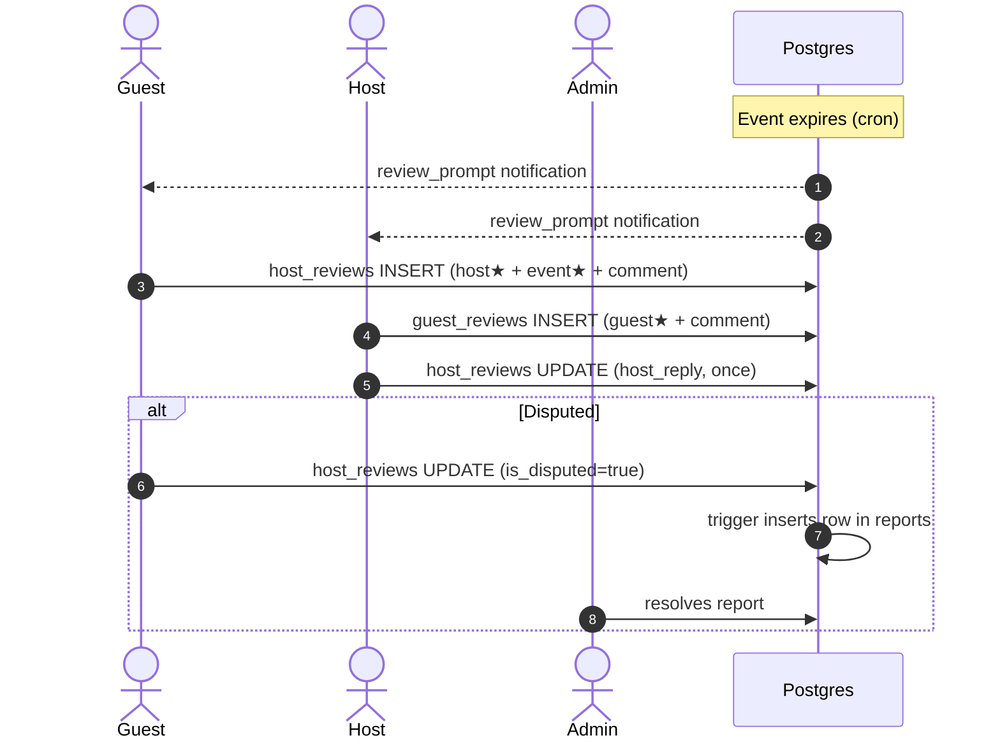

# Lincc

**Everything happening around you, in one place.**

Lincc is a local events and discovery platform that surfaces what's happening around you in real time — events, deals, openings, and offers. Personal users discover and host meetups; businesses promote themselves with verified profiles, recurring events, vouchers and (later) ticket sales. Your local pulse.

- **Live**: [lincc.live](https://lincc.live) (also `lincc-six.vercel.app`)
- **Status**: pre-launch / demo-ready — landing page with waitlist is live, full app builds clean, all 51 page routes wired
- **PRD**: `PRD/Lincc PRD V1.rtf`
- **Tasks & changelog**: [`docs/TODO.md`](docs/TODO.md)
- **Project guide for AI agents**: [`CLAUDE.md`](CLAUDE.md)

### Sanity check (last audit: 2026-05-12)

| Area | Status |
|---|---|
| `npm run build` | ✅ clean |
| `npx tsc --noEmit` | ✅ clean |
| `npm run test:run` | ✅ 57 / 57 passing |
| Routes vs pages | ✅ 51 pages routed, no orphans, no dangling paths |
| `DEV_MODE` flags | ✅ all `false` (`AuthContext`, `eventService`, `useUserEngagement`) |

### Fixed in audit follow-up (2026-05-12)

| # | Fix | Migration / file |
|---|---|---|
| 1 + 5 | `redeem_voucher(uuid)` SECURITY DEFINER RPC: row-locks the voucher, checks status / expiry / limit / uniqueness, inserts redemption + increments count atomically. `voucherService.redeemVoucher` rewritten to call it with friendly error mapping. | `052_enforce_capacity_and_redemptions.sql` |
| 2 | `enforce_event_capacity_trigger` BEFORE INSERT/UPDATE on `event_participants` — raises `event_full` if the approved count would exceed `events.capacity`. | `052_enforce_capacity_and_redemptions.sql` |
| 6 | `export_user_data()` RPC returns JSON of every row the caller owns (profile, business, hosted/joined events, messages, follows, blocks, saved, redemptions, reviews, reports filed, notifications, feedback). Settings page downloads it as `lincc-data-YYYY-MM-DD.json`. | `053_gdpr_export_user_data.sql`, `SettingsPage.tsx` |
| 7 | Replaced `prompt()` with a proper Modal for "Flag user" — autoFocused Input + cancel/confirm buttons. Reason still gets logged to `admin_audit_log`. | `pages/admin/UserDetailPage.tsx` |
| 8 | Added `deleteHostReview` + `deleteGuestReview` to `moderationService` + a "Delete review" action button in the Reports queue moderation grid (only renders when the report carries `host_review_id` or `guest_review_id`). Author gets a `review_removed` notification. | `services/moderationService.ts`, `pages/admin/ReportsPage.tsx` |

### Fixed in audit follow-up (2026-05-12, cont.)

| # | Fix | Migration / file |
|---|---|---|
| 3 | `allow_dms` moved from per-event (`events.allow_dms`) to per-host (`profiles.allow_dms`). New `conversations` INSERT RLS blocks anyone from opening a fresh DM thread with a host whose profile setting is off — existing conversations keep working. `CreateEventPage` mirrors the toggle into the host profile (acts as a global preference), and `SettingsPage` exposes it as a standalone toggle so it can be changed without creating an event. Backfilled from existing event opt-outs. | `054_allow_dms_global_and_chat_archive.sql`, `SettingsPage.tsx`, `CreateEventPage.tsx` |
| 4 | Event chats become inaccessible past `expires_at + 24h`. Enforced at the RLS layer (admins still see via the existing ALL policy). `messages` INSERT is also blocked once the event ends — no new posts in a dead chat. `ChatRoomPage` shows a dedicated "Chat archived" empty state past the 24h cutoff and a "Event ended — read-only" banner with disabled input during the 24h grace window. Messages stay in the DB so reports keep working. | `054_allow_dms_global_and_chat_archive.sql`, `ChatRoomPage.tsx` |

**Verified working (claims in earlier audits that turned out to be false alarms)**
- `business_verifications` table and `businesses.verified` column **do** exist (migrations 045 + 047)
- `/pending-approval` route **does** exist (`App.tsx:162`)
- Push notification subscribe is called from `OnboardingPage.tsx:487` and `SettingsPage.tsx`
- `expire_past_events()` cron runs every 5 min and fires `notify_review_prompts_on_expiry` → review prompts work end-to-end
- Event approve/decline notifications fire via DB triggers, not frontend code

**Working but worth knowing**
- Review system is otherwise complete: bidirectional star ratings, single reply per side enforced by RLS (`USING (host_reply IS NULL)`), disputes auto-file reports via trigger, `RatingBadges` renders real averages
- All moderation actions (warn/suspend/ban/delete message/remove participant/cancel event) work and audit-log
- Business approval + verification doc upload + signed-URL review flow all work

---

## Tech Stack

| Layer | Technology |
|-------|-----------|
| Frontend | React 19 + TypeScript 5.9 |
| Build | Vite 7, vite-plugin-pwa, Workbox |
| Styling | Tailwind CSS 4 (utility-first, runtime CSS-var theme) |
| State / Data | Supabase JS (Auth, DB, Realtime, Storage, Edge Functions) |
| Maps | Mapbox GL JS |
| Venues | Google Places (New) JS SDK |
| Image cropping | react-easy-crop |
| Errors | Sentry |
| Analytics | Google Analytics 4 (consent-gated) |
| Hosting | Vercel (auto-deploy from `main`) |

---

## High-level architecture



---

## Route map

Every route is wrapped in either `PublicRoute` (redirects authed users away from login/signup), `ProtectedRoute` (auth + profile + terms gating), or `ProtectedRoute requireAdmin`. Pages are lazy-loaded except the two auth entry points.



---

## Account & business flow

Lincc treats Personal and Business as distinct account types chosen at signup. Businesses go through admin approval and (optional) document verification to earn a tick.



---

## App flow (Personal user)



---

## Reporting & moderation

Anyone can report users, events, reviews, or chat messages. Reports flow into the admin queue with full context, and admins have a real action toolkit — not just a "mark resolved" button.



---

## Bidirectional review system

Both directions of the review relationship are first-class. Guests rate the host **and** the event; hosts rate each guest. Either party can dispute a review which lands in admin moderation.



---

## Database schema (high-level)


---

## Project structure

```
src/
├── components/
│   ├── layout/         MainLayout, Header, BottomNav, SideNav, ScrollToTop, ProtectedRoute
│   ├── ui/             Button, Card, Modal, BottomSheet, Avatar, AvatarCropper, Toggle, Skeleton, MapView…
│   ├── features/       EventReviewsSection, HostReviewsList, GuestReviewsList, ReviewPromptModal, RatingBadges
│   ├── business/       VerifiedTick, BusinessCard, BusinessHoursDisplay, BusinessApprovalBanner
│   ├── pwa/            InstallBanner, OfflineBanner, UpdateNotification, InstallAppCard
│   ├── social/         ReportDialog, ReportMessageDialog, FollowButton
│   ├── admin/          ActivityChart, EngagementChart, ActivityFeed, DateRangePicker, TopList
│   ├── AnalyticsTracker.tsx
│   └── CookieConsentBanner.tsx
├── contexts/           AuthContext (profile + business), ToastContext, ViewModeContext
├── hooks/              useRecommendedEvents, useEventChat, useDMChat, usePWA, useDarkMode,
│                       useAnalytics, useNotifications, usePendingReviews, useUserLocation, …
├── lib/                supabase, utils, algorithm, analytics, consent, imageCompression, haptics, abTest, cache
├── pages/
│   ├── auth/           LoginPage, SignupPage, TermsPage, PendingApprovalPage
│   ├── onboarding/     OnboardingPage
│   ├── admin/          DashboardPage, UsersPage, EventsPage, ReportsPage, BusinessesPage,
│                       BusinessApplicationsPage, BusinessDetailPage, CategoriesPage, AnnouncementsPage,
│                       FeatureFlagsPage, AuditLogPage, UserDetailPage
│   ├── landing/        AboutPage, PrivacyPage, TermsPage, ContactPage
│   └── *.tsx           HomePage, EventDetailPage, CreateEventPage, EditProfilePage,
│                       BusinessPage, BusinessDashboardPage, BusinessVerifyPage, EditBusinessProfilePage,
│                       VouchersPage, VoucherDetailPage, CreateVoucherPage,
│                       ChatsPage, ChatRoomPage, DMChatRoomPage,
│                       ProfilePage, UserProfilePage, FollowListPage,
│                       SavedEventsPage, ExplorePage, NotificationsPage,
│                       BusinessDirectoryPage, SearchPeoplePage, ManageParticipantsPage,
│                       FeedbackPage, SettingsPage
├── services/
│   ├── events/         eventService, recommendationService, participantService, transformers
│   ├── chat/           chatService, dmService
│   ├── reviews/        hostReviewService, guestReviewService, pendingReviewsService
│   ├── adminService.ts moderationService.ts businessService.ts voucherService.ts
│   ├── verificationService.ts notificationService.ts pushService.ts
│   ├── searchService.ts bookmarkService.ts blockService.ts reportService.ts followService.ts
│   └── placesService.ts
├── data/               categories.ts (with subcategories), demoEvents.ts, tagToCategoryMap.ts
└── types/              index.ts (domain types), supabase.ts (generated)

landing/                Separate marketing/waitlist site (own Vite build)
supabase/
├── migrations/         001 → 049 (numbered, applied in order)
├── functions/          send-welcome-email, send-waitlist-email, send-push-notification
└── email-templates/    All 13 auth/security templates + waitlist + welcome
```

---

## Features

### Auth & onboarding
- Email/password login + magic link + Google OAuth (`pages/auth/LoginPage.tsx`)
- Forgot password → reset link → update password flow
- Account-type chooser at signup (Personal / Business)
- Personal signup: email, password, first/last name, terms + age 18+ gate
- Business signup: email, password, business name, category — lands on `/pending-approval`
- Email verification with resend
- 7-step onboarding wizard: avatar + crop, name, DOB (18+), gender (female/male), interests, bio, location consent, PWA install + push opt-in
- Profile photo upload with HEIC→JPG, magic-byte validation, 25 MB cap, custom round-crop UI
- Two-effect AuthContext pattern (sync listener + async profile fetch with cancellation) to prevent stale state

### Discovery & feed
- Personalized recommendations: location proximity (Haversine), interests (tag→category), engagement history, time prefs, gender filter — fallback cascade nearby → category → any, never empty
- Mapbox map view with category-coloured pins and radius circle
- List ↔ map toggle (ViewModeContext)
- Distance slider 1–100 km, debounced 300 ms, hard cap 100 km on discovery
- Category multi-select with Lucide icons
- Date filter — quick options (This hour, Tonight, This week) + custom picker
- UK postcode / place-name detection in the search bar → geocodes via Mapbox to centre discovery on a custom location
- Full-text search (`tsvector` + GIN) with recent searches in localStorage
- Pull-to-refresh
- Nearby vs "further afield" split, "Create your own" CTA when nothing matches
- Women-only visibility mode (female users see women-only events; men never do)
- Voucher carousel of active deals filtered by distance

### Events
- 5-step create wizard (category → subcategory → details → when → guests) with `sessionStorage` draft recovery
- Venue autocomplete via Google Places (New) JS SDK + manual lat/lng fallback
- Capacity (min 1, no upper bound), join mode (request / auto), audience (everyone / women / men), DM toggle, cover image
- Auto-expire 2 h after `start_time` via `pg_cron` → fires `review_prompt` notifications
- Event detail: hero image, host card with trust badges, capacity meter, distance, map preview, share sheet, bookmark, report, block
- Join flow: request → host approves in `/event/:id/manage`, or auto-join
- Host tools: approve/decline/remove participants, edit, cancel, view pending count badge
- My Events: Hosting / Joined tabs, upcoming / past filters

### Chat
- Event chat — real-time via Supabase Realtime (`messages` channel), participants + host only, auto-archived 24 h after event end
- DMs — 1:1 `conversations` with `direct_messages`, "Allow DMs" toggle on events
- Chats hub with Events tab + Friends tab + unread badges
- Share cards inside chat: voucher share, event share

### Social
- Follow / unfollow, follower + following counts, follow list page
- Suggested users (`suggest_users` RPC with fallback)
- Block / unblock, blocked list in settings
- Report users, events, reviews, or specific messages (`reports.message_id` / `dm_message_id`)
- Bidirectional 5-star reviews — guest → host + event, host → guest, single reply allowed per side, disputable
- Pending-review prompt modal on home, dismissible per-session
- Trust badges + average rating on profile and event cards

### Vouchers & business
- Vouchers: title, discount text, original + discounted price, redemption code, expiry, limit, location, cover image
- Active voucher carousel on home, "Ending soon" + "Almost gone" chips
- Voucher detail: scratch-card reveal, swipe-to-redeem, redemption tracked per user
- Business dashboard tabs: events, vouchers, locations, hours, reviews, recent activity, owner-only stats
- Public business profile: hero, verification tick, stats, reviews, active deals
- Multi-location chains (`business_locations` with `is_primary`)
- Business directory + per-category browse
- Soft-gate banner for pending businesses; publishing blocked at DB trigger level
- Business verification — selfie + ID + selfie-with-ID + registration doc via signed URLs

### Admin panel
- Dashboard — action-needed counters, growth chart, engagement chart, top hosts / categories / businesses, recent activity, system status
- Users — search, filter, bulk status updates, role grant/revoke, password reset email, flag/unflag, **hard-delete (with type-to-confirm)**, CSV export
- Events — search, status filter, flag/unflag, status update (active/cancelled/deleted), CSV export
- Reports — reason filter, embedded review + chat context, toolkit: warn / suspend / ban / delete message / remove from event / cancel event / dismiss
- Businesses — list, applications queue, detail page, approve / reject (with reason → notification), suspend
- Categories — CRUD with subcategory parent/child cascade, icon + sort order
- Announcements — create with type + expiry, toggle active, delete, renders as banner globally
- Feature flags — toggle global features, updater audit
- Audit log — every admin action with admin name, target, details, timestamps
- Images — gallery across `avatars` / `event-images` / `business-logos` buckets, delete with referencing row cleanup
- Waitlist — personal / business / all tabs

### Notifications
- In-app notification centre with deep-links per type, mark-read, mark-all-read
- Types: join_request, request_approved/declined, new_message, event_cancelled, event_starting, nearby_event, voucher_share, review_prompt, business_approved/rejected, follow_started
- Web Push (VAPID) — subscribe via service worker, delivered through `send-push-notification` Edge Function
- Per-type notification preferences + quiet hours (stored on `profiles.notification_preferences` JSONB)

### PWA
- Installable — `vite-plugin-pwa` (autoUpdate) + custom `site.webmanifest` with maskable icons and app shortcuts (Create Event, My Chats)
- Workbox precaching + runtime caching: Google Fonts (CacheFirst 1 y), Mapbox (NetworkFirst 1 d), Supabase REST (NetworkFirst 1 h), Supabase Storage (CacheFirst 1 w)
- Offline shell + branded `offline.html`
- Offline banner, private-browsing banner, update prompt (non-dismissable when waiting)
- App shortcuts in home-screen menu

### Settings & account
- Edit profile (name, bio, tags, gender, avatar)
- Change email + change password
- Dark mode toggle + system preference, persisted to localStorage
- Notification preferences + quiet hours
- Location permission display + revoke instructions when browser-blocked
- Cookie consent gate before GA fires
- GDPR account delete via `delete_user_account` RPC
- In-app feedback form (bug / feature / general)

### Trust, safety & infra
- Sentry error boundary (top-level) + route-level `<ErrorBoundary>` wrappers
- Toast system for all user feedback
- Analytics — consent-gated GA4 + recommendation impression/click/fallback tracking
- A/B testing with persistent variant assignment
- Haptics on mobile interactions (`navigator.vibrate`)
- HEIC + magic-byte image validation, cloud-only photo (Samsung/iCloud) detection with tailored toast
- RLS on every table, `is_admin()` + `user_is_event_participant()` SECURITY DEFINER helpers to avoid circular RLS

---

## Getting started

```bash
npm install
npm run dev
```

Create a `.env.local`:

```env
VITE_SUPABASE_URL=https://your-project.supabase.co
VITE_SUPABASE_ANON_KEY=ey…
VITE_MAPBOX_TOKEN=pk.ey…
VITE_GOOGLE_PLACES_API_KEY=AIza…
VITE_VAPID_PUBLIC_KEY=BAu2…
VITE_SENTRY_DSN=https://…@sentry.io/…
VITE_GA_MEASUREMENT_ID=G-XXXXXXXXXX   # optional — analytics no-ops without it
VITE_APP_URL=http://localhost:5173
```

The app boots at `http://localhost:5173`. Database migrations live in `supabase/migrations/` — they're reference files and don't auto-apply; run them via the Supabase Dashboard SQL editor or `supabase db push`.

---

## Scripts

| Command | Description |
|---------|-------------|
| `npm run dev` | Vite dev server with HMR |
| `npm run build` | TypeScript check + production build |
| `npx tsc --noEmit` | Type-check only (no emit) |
| `npm run test` | Vitest in watch mode |
| `npm run test:run` | Vitest single run (57 tests) |
| `npm run test:e2e` | Playwright E2E tests |

---

## Deployment

- **Hosting** — Vercel, auto-deploys on push to `main`. SPA rewrites in `vercel.json`
- **Database** — Supabase project `srrubyupwiiqnehshszd` (production-ready)
- **Email** — Custom SMTP via Resend (`noreply@system.lincc.live`); 15 branded templates
- **Push** — Web Push via VAPID + custom service worker; Edge Function `send-push-notification`
- **PWA** — vite-plugin-pwa with `autoUpdate`, runtime caching for fonts, Mapbox, Supabase
- **Cron** — `pg_cron` runs `expire_past_events()` every 5 minutes; expiry trigger fires `review_prompt` notifications

---

## Migrations cheat sheet

| # | Purpose |
|---|---------|
| 001 | Initial schema, RLS, triggers, indexes |
| 010 | `handle_new_user` trigger |
| 016 | Vouchers |
| 017 | Direct messages, conversations |
| 020 | Business profiles |
| 028 | Reviews + admin role tiers |
| 033 | `businesses` table (separate entity) |
| 034 | `business_locations` (chain support) |
| 035 | `events.business_id` |
| 042 | participant count trigger fix |
| 043 | Host reviews + dispute trigger |
| 044 | Bidirectional reviews (`host_reviews` + `guest_reviews`) |
| 045 | Account types + business approval workflow |
| 047 | Business verifications + storage bucket |
| 049 | Chat reports (`message_id`, `dm_message_id` on reports) |
| 047_fix | Restore account_type + pending business creation in `handle_new_user` (regression fix) |
| 050 | `waitlist` admin SELECT policy |
| 051 | `admin_delete_user_account(uuid)` RPC — hard-delete with admin guard |
| 052 | Atomic `redeem_voucher(uuid)` RPC + `enforce_event_capacity` trigger |
| 053 | `export_user_data()` RPC for GDPR data portability |
| 054 | `profiles.allow_dms` (global) + conversations RLS gate + 24h chat-archive RLS on messages |

Full list under `supabase/migrations/`.

---

## License

All rights reserved. Private repository.
